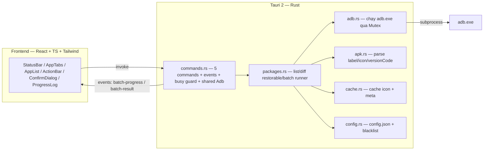

# Droid Vault

Công cụ desktop (Windows) quản lý ứng dụng Android qua ADB: xem danh sách app với **icon + tên + package name đúng như trên máy**, chia tab **User apps / System apps**, **gỡ cài đặt cho user 0** (giữ dữ liệu, khôi phục được) và **khôi phục** app đã gỡ — từng app hoặc hàng loạt.

> Công nghệ: **Tauri 2** (Rust backend + React/TypeScript/TailwindCSS frontend). File `.exe` nhẹ (~3–10 MB bản release), RAM ~40 MB.

## Mục lục

- [Tính năng](#tính-năng)
- [Yêu cầu hệ thống](#yêu-cầu-hệ-thống)
- [Cài đặt & Build](#cài-đặt--build)
- [Sử dụng](#sử-dụng)
- [Cấu hình](#cấu-hình)
- [Kiến trúc](#kiến-trúc)
- [Hạn chế đã biết](#hạn-chế-đã-biết)
- [License](#license)
- [Liên hệ](#liên-hệ)

## Tính năng

- Tự động phát hiện thiết bị cắm qua USB (poll mỗi 2 giây), hiển thị 3 trạng thái: Đã kết nối (kèm tên model) / Chưa được phép / Chưa có thiết bị.
- Danh sách app đầy đủ theo 2 tab USER APPS / SYSTEM APPS: icon thật + tên app + package name đọc trực tiếp từ `base.apk` trên máy.
- Badge **"Đã gỡ (khôi phục được)"** cho app đã gỡ bằng `pm uninstall -k --user 0` nhưng vẫn còn trên hệ thống.
- Tìm kiếm tức thời theo tên app / package name; chọn nhiều app; chọn tất cả theo tab; lựa chọn được giữ khi chuyển tab.
- **Gỡ hàng loạt**: `adb shell pm uninstall -k --user 0 <package>` — giữ dữ liệu, có thể khôi phục.
- **Khôi phục hàng loạt**: `adb shell cmd package install-existing <package>`.
- Chạy tuần tự từng app với thanh tiến trình + log kết quả từng app; hộp xác nhận trước khi thực hiện, cảnh báo kép với system app.
- **Blacklist** cấm gỡ các app hệ thống cốt lõi (cấu hình được, xem [Cấu hình](#cấu-hình)).
- Cache icon/tên theo `package + versionCode` — lần mở sau không phải pull lại APK.

## Yêu cầu hệ thống

- Windows 10/11 (dùng WebView2 — có sẵn trên Windows 10/11).
- [Node.js](https://nodejs.org/) ≥ 20 và [Rust](https://rustup.rs/) (MSVC toolchain + **Visual Studio Build Tools** với workload "C++ build tools").
- [Android platform-tools](https://developer.android.com/tools/releases/platform-tools) (chứa `adb.exe`) — mặc định tool dò theo PATH rồi fallback về `C:\platform-tools\platform-tools\adb.exe`.

## Cài đặt & Build

```bash
# 1. Clone/copy project
cd droid-vault-12092026

# 2. Cài dependencies frontend
npm install

# 3. Chạy ở chế độ dev (khởi động vite + app)
npm run tauri dev

# 4. Build bản release (kết quả: src-tauri/target/release/droid-vault.exe + installer)
npm run tauri build
```

**Lưu ý cho Git Bash**: trên một số máy, Git Bash resolve nhầm `link` của GNU coreutils thay vì `link.exe` của MSVC khiến cargo build lỗi. Khi đó hãy chạy trong **PowerShell/CMD** (đã `vcvars64`) hoặc export biến môi trường MSVC trước khi chạy cargo:

```bash
export PATH="/c/Program Files/Microsoft Visual Studio/2022/Community/VC/Tools/MSVC/<phiên-bản>/bin/Hostx64/x64:/c/Program Files (x86)/Windows Kits/10/bin/<sdk>/x64:$PATH"
export LIB="...MSVC lib\\x64;...Windows Kits\\10\\Lib\\<sdk>\\ucrt\\x64;...Windows Kits\\10\\Lib\\<sdk>\\um\\x64"
export INCLUDE="...MSVC include;...Windows Kits\\10\\Include\\<sdk>\\{ucrt,um,shared,winrt}"
```

**Lưu ý**: file `target/debug/droid-vault.exe` (debug build) chạy độc lập sẽ trỏ tới dev server `localhost:1420` (hành vi mặc định của template Tauri) — hãy dùng `npm run tauri dev` khi dev, và `npm run tauri build` để có `.exe` chạy độc lập.

### Kiểm thử

```bash
npm run build                                  # build frontend (tsc + vite)
cd src-tauri && cargo test                     # 75 unit/integration tests của backend
```

## Sử dụng

1. Trên điện thoại: bật **Gỡ lỗi USB** (Settings → Developer options).
   - **Máy Oppo/Realme/OnePlus (ColorOS)**: phải bật thêm **"USB debugging (Security settings)"**, nếu không các lệnh `pm` có thể bị từ chối.
2. Cắm cáp USB, mở Droid Vault — chờ trạng thái chuyển **"Đã kết nối: \<model\>"**. Lần đầu cắm, điện thoại sẽ hỏi cho phép gỡ lỗi USB → bấm **Cho phép**.
3. App tự quét danh sách ứng dụng (lần đầu có thể mất vài phút do phải pull từng `base.apk` về parse; các lần sau dùng cache nên nhanh hơn nhiều).
4. Chuyển tab **USER APPS / SYSTEM APPS**, tìm kiếm, tick chọn app cần xử lý.
5. Bấm **Gỡ cài đặt** hoặc **Khôi phục** → xác nhận trong dialog (đọc cảnh báo nếu có) → theo dõi tiến trình và log kết quả từng app.
6. App đã gỡ vẫn hiển thị với badge **"Đã gỡ (khôi phục được)"** — tick chọn và bấm **Khôi phục** để trả về như cũ (dữ liệu được giữ nhờ `-k`).

⚠️ **Cảnh báo**: đừng gỡ bừa system app (`com.android.systemui`, `com.android.settings`…). Tool chặn sẵn blacklist mặc định, nhưng trách nhiệm cuối vẫn thuộc về người dùng.

## Cấu hình

File: `%APPDATA%\com.droidvault.app\config.json` (tự tạo lần đầu chạy). Có thể sửa rồi bấm "Làm mới"/khởi động lại app:

```json
{
  "adb_path": null,                  // null = tự dò PATH → fallback C:\platform-tools\platform-tools\adb.exe
  "blacklist": [                     // package bị cấm gỡ, bổ sung tùy ý
    "android", "com.android.systemui", "com.android.settings",
    "com.android.phone", "com.android.providers.telephony", "com.android.providers.contacts"
  ],
  "theme": "dark"
}
```

## Kiến trúc



Chi tiết quy trình xây dựng (11 task / 8 wave, TDD, review 2 vòng) nằm ở `docs/plan/` và `docs/harness-logs/`.

## Hạn chế đã biết

- App gỡ cho user 0 nhưng APK từng update trước đó: cache version có thể chưa được kiểm chứng ở góc này trên Android 12+ (icon/tên cũ có thể hiển thị đến lần quét kế tiếp).
- Đường dẫn `adb.exe` được cache đến khi khởi động lại app (sửa `config.json` cần restart).
- Batch tiếp tục chạy với các app kế tiếp khi 1 app lỗi (kết quả từng app hiển thị đầy đủ trong log).
- Debug exe chạy độc lập cần dev server (xem [Cài đặt & Build](#cài-đặt--build)).

## License

Chưa gán license (dùng nội bộ/cá nhân).

## Liên hệ

- **Author**: ntd237
- **Email**: ntd237.work@gmail.com
- **GitHub**: https://github.com/ntd237
