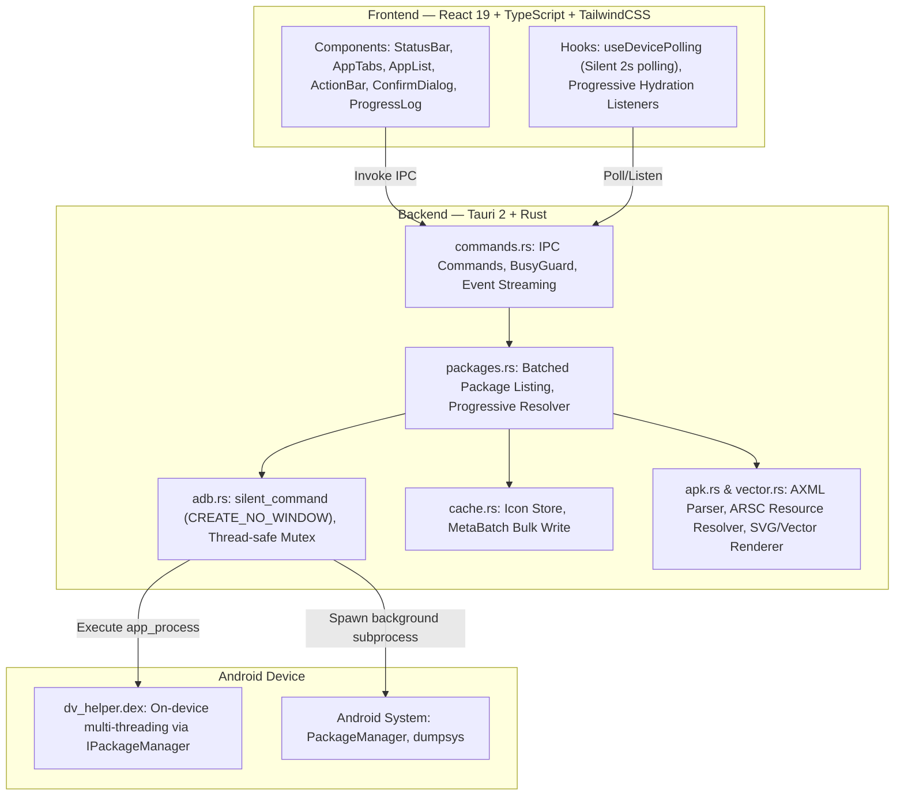

# Droid Vault

> Quản lý ứng dụng Android qua ADB trên Windows: xem danh sách với icon và tên thật, phân loại User/System apps, gỡ cài đặt giữ dữ liệu và khôi phục an toàn.

[](package.json)
[](#yêu-cầu-hệ-thống)
[](https://tauri.app/)
[](#license)

## Table of Contents

- [Introduction](#introduction)
- [Features](#features)
- [Architecture](#architecture)
- [Installation](#installation)
- [Usage](#usage)
- [Configuration](#configuration)
- [Known Limitations](#known-limitations)
- [License](#license)
- [Contact](#contact)

---

## Introduction

**Droid Vault** giải quyết bài toán quản lý và dọn dẹp các ứng dụng rác (bloatware) trên thiết bị Android từ máy tính mà không yêu cầu quyền Root.

Nhiều công cụ ADB thông thường chỉ hiển thị danh sách package name đơn thuần (`com.example.app`) khiến người dùng khó nhận diện ứng dụng thực tế. Droid Vault tự động trích xuất và hiển thị **icon chuẩn 192x192** cùng **tên hiển thị chính xác** của từng ứng dụng, phân tách rõ ràng giữa ứng dụng do người dùng cài và ứng dụng hệ thống. Công cụ hỗ trợ gỡ cài đặt cho tài khoản hiện tại (`user 0`) đồng thời bảo lưu dữ liệu và cho phép khôi phục lại bất kỳ lúc nào chỉ với một thao tác.

### Công nghệ sử dụng
- **Backend**: [Rust](https://www.rust-lang.org/) + [Tauri 2](https://v2.tauri.app/) (nhẹ, bảo mật, tài nguyên RAM ~40 MB).
- **Frontend**: [React 19](https://react.dev/), [TypeScript](https://www.typescriptlang.org/), [TailwindCSS](https://tailwindcss.com/).
- **Android Integration**: ADB Subprocess Management (Windows `CREATE_NO_WINDOW`), kết hợp On-device Helper (`app_process` Java/DEX).

---

## Features

### Tính năng cốt lõi
- **Tự động nhận diện thiết bị**: Polling ngầm mỗi 2 giây trạng thái kết nối ADB (Connected / Unauthorized / None), hiển thị chính xác model thiết bị.
- **Hoạt động ngầm êm ái (Silent Background)**: Mọi thao tác ADB được gắn cờ Windows `CREATE_NO_WINDOW` (`0x08000000`), loại bỏ hoàn toàn hiện tượng nhấp nháy cửa sổ command prompt trên Windows.
- **Quét ứng dụng siêu tốc**:
  - *Cold Scan*: ~7 giây cho toàn bộ ~460 ứng dụng nhờ helper đa luồng trên thiết bị.
  - *Warm Scan*: Tức thì nhờ cơ chế cache metadata (`meta.json` schema 7) và icon PNG nội bộ.
  - *Progressive Hydration*: Hiển thị danh sách ngay trong giây đầu tiên, stream cập nhật icon và nhãn mượt mà theo thời gian thực.
- **Icon & Nhãn hiển thị chuẩn xác**: Hỗ trợ giải mã toàn diện Android Adaptive Icon (AXML vector drawable, gradient, layer list) và raster drawable về canvas chuẩn 192x192.
- **Phân loại rõ ràng**: Tách biệt 2 tab **USER APPS** (ứng dụng cài thêm) và **SYSTEM APPS** (ứng dụng hệ thống).
- **Gỡ cài đặt an toàn cho User 0**: Thực thi `pm uninstall -k --user 0 <package>` — gỡ bỏ app khỏi giao diện người dùng nhưng vẫn giữ nguyên dữ liệu và APK gốc để khôi phục.
- **Khôi phục dễ dàng**: Thực thi `cmd package install-existing <package>` cho các app hệ thống có badge **"Đã gỡ (khôi phục được)"**.
- **Thao tác hàng loạt**: Chọn nhiều app, chọn tất cả theo tab, thực thi hàng loạt có thanh tiến trình và log chi tiết.
- **Bảo vệ an toàn (Blacklist)**: Chặn gỡ các gói cốt lõi của hệ điều hành (Settings, SystemUI, Phone...).

---

## Architecture



---

## Installation

### Yêu cầu tiên quyết
- **Hệ điều hành**: Windows 10/11 x64 (đã tích hợp WebView2 Runtime).
- **Android Platform Tools**: Máy tính cần có `adb.exe`. Droid Vault tự dò theo biến môi trường `PATH`, hoặc fallback tại `C:\platform-tools\platform-tools\adb.exe`, hoặc cấu hình thủ công trong `config.json`.
- **Môi trường lập trình (để build mã nguồn)**:
  - [Node.js](https://nodejs.org/) ≥ 20.
  - [Rust](https://rustup.rs/) (MSVC toolchain) + Visual Studio C++ Build Tools.

### Tải bản dựng sẵn (Người dùng cuối)
Các bản đóng gói phát hành nằm trong thư mục `src-tauri/target/release/bundle/`:
- **Bản cài đặt NSIS**: `Droid Vault_0.1.0_x64-setup.exe` (Khuyến nghị, dung lượng ~2.5 MB).
- **Bản cài đặt MSI**: `Droid Vault_0.1.0_x64_en-US.msi` (~3.5 MB).
- **Bản Portable (Chạy ngay)**: `src-tauri/target/release/droid-vault.exe` (~7.3 MB).

### Build từ mã nguồn

```bash
# 1. Clone repository
git clone https://github.com/ntd237/droid-vault-12092026.git
cd droid-vault-12092026

# 2. Cài đặt các gói phụ thuộc frontend
npm install

# 3. Khởi chạy ở chế độ phát triển
npm run tauri dev

# 4. Đóng gói bản phát hành Release
npm run tauri build
```

*Lưu ý khi build với MSVC trên Git Bash*: Nếu hệ thống nhận nhầm `link` của GNU coreutils, hãy export đường dẫn MSVC:
```bash
export PATH="/c/Program Files/Microsoft Visual Studio/2022/Community/VC/Tools/MSVC/<version>/bin/Hostx64/x64:/c/Program Files (x86)/Windows Kits/10/bin/<sdk>/x64:$PATH"
export LIB="C:/Program Files/Microsoft Visual Studio/2022/Community/VC/Tools/MSVC/<version>/lib/x64;C:/Program Files (x86)/Windows Kits/10/Lib/<sdk>/ucrt/x64;C:/Program Files (x86)/Windows Kits/10/Lib/<sdk>/um/x64"
export INCLUDE="C:/Program Files/Microsoft Visual Studio/2022/Community/VC/Tools/MSVC/<version>/include;C:/Program Files (x86)/Windows Kits/10/include/<sdk>/ucrt;C:/Program Files (x86)/Windows Kits/10/include/<sdk>/shared;C:/Program Files (x86)/Windows Kits/10/include/<sdk>/um;C:/Program Files (x86)/Windows Kits/10/include/<sdk>/winrt"
```

### Chạy kiểm thử tự động
```bash
# Frontend build test
npm run build

# Backend test suite (178 unit và integration tests)
cd src-tauri && cargo test --lib
```

---

## Usage

### 1. Chuẩn bị trên điện thoại
- Mở **Cài đặt** -> **Thông tin điện thoại** -> Nhấn 7 lần vào **Số bản dựng** (Build Number) để mở menu Nhà phát triển.
- Vào **Tùy chọn cho nhà phát triển** (Developer options) -> Bật **Gỡ lỗi USB** (USB debugging).
- *Đối với máy Xiaomi (MIUI/HyperOS) hoặc Oppo/Realme/OnePlus (ColorOS)*: Bắt buộc bật thêm **"Gỡ lỗi USB (Cài đặt bảo mật)"** để cho phép can thiệp quyền quản lý ứng dụng.

### 2. Kết nối và Quét ứng dụng
- Cắm cáp USB kết nối điện thoại với máy tính và mở Droid Vault.
- Khi màn hình điện thoại hiện hộp thoại cấp quyền, tick chọn "Luôn cho phép" và bấm **Cho phép**.
- Trạng thái kết nối tại góc trên bên phải sẽ hiển thị: `Đã kết nối: <Tên thiết bị>`.
- Danh sách ứng dụng sẽ được nạp tự động. Bấm nút **"Làm mới"** trên thanh công cụ AppTabs bất kỳ lúc nào để quét lại.

### 3. Gỡ cài đặt hoặc Khôi phục ứng dụng
1. Chọn tab **USER APPS** hoặc **SYSTEM APPS**.
2. Tìm kiếm ứng dụng theo tên hoặc package name.
3. Tick chọn các ứng dụng cần xử lý.
4. Bấm **Gỡ cài đặt** hoặc **Khôi phục** ở thanh thao tác phía dưới.
5. Kiểm tra kỹ danh sách trong hộp thoại xác nhận trước khi thực hiện.
6. Theo dõi tiến trình thực thi trực tiếp qua thanh tiến trình và bảng log.

---

## Configuration

Tệp cấu hình lưu trữ tại `%APPDATA%\com.droidvault.app\config.json` (tự khởi tạo trong lần chạy đầu):

```json
{
  "adb_path": null,
  "blacklist": [
    "android",
    "com.android.systemui",
    "com.android.settings",
    "com.android.phone",
    "com.android.providers.telephony",
    "com.android.providers.contacts"
  ],
  "theme": "dark"
}
```

- `adb_path`: Đường dẫn tùy chỉnh tới `adb.exe` (mặc định `null` để tự nhận diện).
- `blacklist`: Danh sách các package name bị cấm gỡ nhằm ngăn chặn lỗi hệ thống.
- `theme`: Giao diện ứng dụng (`dark`).

---

## Known Limitations

- **Phụ thuộc ADB**: Ứng dụng yêu cầu máy tính phải có môi trường `adb.exe` khả dụng.
- **Ứng dụng Overlay (RRO)**: Một số gói tài nguyên giao diện hệ thống thuần overlay không có launcher activity sẽ hiển thị theo tên package gốc.
- **Cảnh báo SmartScreen**: Bản dựng chưa ký chứng chỉ số (Code Signing Certificate), do đó Windows Defender SmartScreen có thể hiển thị cảnh báo bảo vệ ở lần đầu khởi chạy (chọn *More info* -> *Run anyway*).

---

## License

Chưa gán license (Dự án phát triển nội bộ / cá nhân).

---

## Contact

- **Author**: ntd237
- **Email**: ntd237.work@gmail.com
- **GitHub**: https://github.com/ntd237
