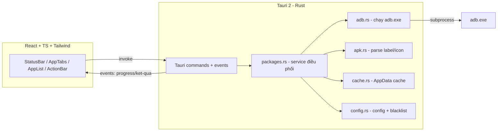

# Droid Vault — Kế hoạch triển khai (new_project, Pipeline 3)

> Nguồn yêu cầu: `PROMPT.md`. Phân loại task: `new_project`. Kiến trúc: desktop app (không thuộc loại AI tham chiếu → dùng cấu trúc custom theo chuẩn Tauri 2, Step C).

## Giai đoạn 0: Làm rõ đầu vào

- **Ngôn ngữ/framework**: Rust (backend Tauri 2) + TypeScript/React + TailwindCSS (frontend).
- **Codebase**: mới hoàn toàn — workspace chỉ có `PROMPT.md`.
- **Phạm vi**: Multi-module (backend Rust 6 module + frontend React).
- **Bảo mật**: Internal (công cụ cá nhân, chạy lệnh ADB cục bộ).
- **Hiệu năng**: Standard (batch operations, cache để tránh pull lại APK).
- **Môi trường**: Windows 10/11 desktop; ADB 36.0.0 đã cài tại `C:\platform-tools\platform-tools\adb.exe`; Node v24.11.0; rustc 1.96.1.
- **Ràng buộc**: file .exe nhẹ (3–10MB), UI tiếng Việt, UI text trong PROMPT.md.

## Giai đoạn 1: Phân tích yêu cầu

### 1.1 Yêu cầu chức năng theo EARS

| ID | Yêu cầu |
|----|---------|
| R1 | KHI app khởi động, HỆ THỐNG PHẢI xác định đường dẫn `adb.exe` từ config; nếu config trống thì tự dò PATH rồi fallback về `C:\platform-tools\platform-tools\adb.exe` |
| R2 | KHI có thiết bị cắm qua USB, HỆ THỐNG PHẢI hiển thị trạng thái kết nối (Connected kèm model / Unauthorized kèm hướng dẫn / No device) cập nhật mỗi 2 giây |
| R3 | KHI thiết bị ở trạng thái `device`, HỆ THỐNG PHẢI liệt kê User apps từ `pm list packages -3` và System apps từ `pm list packages -s` |
| R4 | KHI hiển thị mỗi app, HỆ THỐNG PHẢI hiển thị icon + label đọc từ `base.apk` (lấy qua `pm path`, chọn dòng chứa `base.apk`) và package name |
| R5 | KHI parse APK thất bại hoặc thiếu icon, HỆ THỐNG PHẢI dùng icon mặc định và label = package name, đánh dấu lỗi trong log thay vì dừng toàn bộ danh sách |
| R6 | KHI một app đã bị gỡ cho user 0 (có trong `pm list packages -u --user 0` nhưng không có trong danh sách installed), HỆ THỐNG PHẢI hiển thị badge "Đã gỡ (khôi phục được)" |
| R7 | KHI icon/label của một `package + versionCode` đã có trong cache, HỆ THỐNG PHẢI dùng cache và không pull lại APK |
| R8 | KHI user bấm "Gỡ cài đặt" sau khi xác nhận, HỆ THỐNG PHẢI chạy tuần tự `adb shell pm uninstall -k --user 0 <pkg>` cho từng app đã chọn, phát sự kiện progress (n/total) và kết quả từng app |
| R9 | KHI user bấm "Khôi phục" sau khi xác nhận, HỆ THỐNG PHẢI chạy tuần tự `adb shell cmd package install-existing <pkg>` tương tự R8 |
| R10 | KHI trong lựa chọn có package thuộc blacklist (đọc từ config), HỆ THỐNG PHẢI chặn gỡ và hiển thị thông báo; system app phải có cảnh báo kép trong dialog xác nhận |
| R11 | KHI cáp bị rút giữa chừng batch, HỆ THỐNG PHẢI dừng batch, báo lỗi rõ ràng, không crash, giữ được danh sách đã load |
| R12 | KHI user tìm kiếm, HỆ THỐNG PHẢI lọc tức thời theo label và package name; lựa chọn checkbox được giữ khi chuyển tab |

### 1.2 Nghiên cứu đã thực hiện (các lượt tư vấn trước, có kiểm chứng nguồn)

- `pm list packages -u` bao gồm package đã gỡ cho user — xác nhận từ mã nguồn AOSP [Pm.java](https://android.googlesource.com/platform/frameworks/base/+/b8678d76c3e09d0d65255f3971b6112a48e19099/cmds/pm/src/com/android/commands/pm/Pm.java).
- ADB không trả label/icon trực tiếp → bắt buộc pull `base.apk` (bỏ qua split APK) rồi parse AXML/ARSC. Crate Rust: [`apk-info-axml`](https://crates.io/crates/apk-info-axml), [`apk_info`](https://docs.rs/apk-info), [`axmldecoder`](https://crates.io/crates/axmldecoder).
- Thiết bị không phải nào cũng có `/system/bin/aapt` → chỉ dùng làm tối ưu hóa tùy chọn, không phải đường chính.
- Tauri 2 dùng WebView2 có sẵn trên Windows → .exe 3–10MB, đạt ràng buộc "nhẹ".

## Giai đoạn 2: Đặc tả giải pháp

### 2.1 Kiến trúc tổng thể



**Chiến lược KISS**: frontend tự poll `list_devices` mỗi 2s (không cần backend thread); mọi lệnh ADB đi qua một `Mutex` toàn cục để tuần tự hóa (đáp ứng "không chạy ADB song song cùng thiết bị"); batch chạy trong 1 command Rust, phát event từng bước.

### 2.2 Bảng đánh đổi (Trade-off Analysis)

| Hướng tiếp cận | Ưu | Nhược | Độ phức tạp | Bảo mật | Khuyến nghị |
|---|---|---|---|---|---|
| **A. Parse APK bằng crate Rust (`apk-info-axml`)** | Không cần runtime ngoài; binary nhỏ | API crate chưa kiểm chứng sâu với label/icon | Trung bình | Low risk | ✅ Chọn |
| B. `axmldecoder` + tự viết ARSC resolver | Kiểm soát hoàn toàn | Phải tự resolve resource reference (phức tạp, dễ sai) | Cao | Low risk | ❌ Chỉ làm fallback |
| C. Dùng `aapt` trên thiết bị khi có | Không phải pull APK | Không phải máy nào cũng có aapt; vẫn cần đường dự phòng | Thấp | Low risk | ⚠️ Tùy chọn tăng tốc, sau bước chính |
| **Frontend poll mỗi 2s** | Đơn giản, đủ dùng | Overhead nhỏ không đáng kể | Thấp | — | ✅ Chọn |
| Backend thread + event push | "Sạch" hơn | Phức tạp hóa không cần thiết (YAGNI) | Trung bình | — | ❌ |
| Cache = file icon + `apps.json` trong AppData | Đơn giản, dễ debug | Chậm hơn DB viền | Thấp | — | ✅ Chọn (SQLite là over-engineering cho ~300 app) |

**Quyết định Chốt**: A + frontend poll + file cache. Đã chấp nhận rủi ro: API `apk-info-axml` cần verify trong T3.1 (spike với APK thật); nếu crate không đáp ứng thì fallback B chỉ cho phần resolve label/icon.

### 2.3 Cấu trúc thư mục (custom structure — Step C, chuẩn Tauri 2)

```
droid-vault-12092026/
├── package.json                    # frontend deps + tauri scripts
├── vite.config.ts
├── index.html
├── tailwind.config.js
├── src/                            # FRONTEND (React + TS)
│   ├── main.tsx
│   ├── App.tsx                     # layout gốc + state điều phối
│   ├── types.ts                    # AppInfo, DeviceState, ProgressEvent...
│   ├── hooks/
│   │   └── useDevicePolling.ts     # poll list_devices mỗi 2s
│   ├── components/
│   │   ├── StatusBar.tsx           # trạng thái kết nối + model máy
│   │   ├── AppTabs.tsx             # 2 tab USER/SYSTEM + ô tìm kiếm
│   │   ├── AppList.tsx             # danh sách app (virtualized)
│   │   ├── AppRow.tsx              # 1 dòng: icon + label + package + checkbox
│   │   ├── ActionBar.tsx           # thanh dưới: số chọn + nút Gỡ/Khôi phục
│   │   ├── ConfirmDialog.tsx       # xác nhận + cảnh báo system app/blacklist
│   │   └── ProgressLog.tsx         # progress bar + log từng app
│   └── lib/
│       └── tauri.ts                # wrapper gọi invoke/listen
├── src-tauri/                      # BACKEND (Rust)
│   ├── Cargo.toml
│   ├── tauri.conf.json
│   ├── capabilities/default.json
│   └── src/
│       ├── main.rs                 # entry, chỉ gọi lib::run()
│       ├── lib.rs                  # setup Tauri, đăng ký commands
│       ├── adb.rs                  # run_adb() qua Mutex + các hàm parse output thuần
│       ├── config.rs               # load/tạo config.json trong AppData (adb_path, blacklist)
│       ├── cache.rs                # cache icon theo <pkg>_<version>.png + meta.json
│       ├── apk.rs                  # parse label/icon từ file APK (apk-info-axml)
│       ├── packages.rs             # service: list apps, diff restorable, batch runner
│       └── commands.rs             # các #[tauri::command] + event emission
├── docs/
│   ├── plan/                       # artifact kế hoạch (file này)
│   └── harness-logs/               # execution log
├── PROMPT.md                       # spec nguồn
└── README.md                       # tạo ở bước 08-readme-management
```

**Config single-source-of-truth**: duy nhất 1 file runtime `config.json` trong AppData (tạo lần đầu từ default nhúng trong binary) chứa: `adb_path`, `blacklist` (danh sách package cấm gỡ — policy nằm ở config, không hardcode), `theme`. Không có tham số nào lặp ở nơi khác.

### 2.4 Edge Cases

| Edge Case | Điều kiện kích hoạt | Hành vi mong đợi | Hậu quả nếu bỏ qua |
|---|---|---|---|
| Danh sách package rỗng | Thiết bị lạ/chưa khởi tạo xong | Hiển thị "Không có app nào" + nút thử lại | UI trông như treo |
| `pm path` trả nhiều dòng (split APK) | App hiện đại | Chọn dòng chứa `base.apk` (đáp ứng R4) | Pull nhầm file .apk nặng không cần thiết |
| APK không parse được / thiếu icon | APK đóng gói đặc biệt | Icon mặc định + label = package name + log cảnh báo (R5) | Crash hoặc mất cả danh sách |
| Thiết bị `unauthorized` | Chưa bấm Cho phép trên máy | Trạng thái Unauthorized + hướng dẫn (R2) | User tưởng app lỗi |
| Cáp rút giữa batch | Mất kết nối giữa vòng lặp | Dừng batch, lỗi rõ ràng, UI không crash (R11) | App treo/kệch cụm |
| `install-existing` trên app chưa bị gỡ | User khôi phục app đang chạy | Báo lỗi ADB nguyên văn cho app đó, tiếp tục app kế tiếp | Batch dừng oan |
| `adb.exe` không tìm thấy | Config sai + không có PATH | Lỗi cấu hình kèm hướng dẫn sửa `config.json` (R1) | Crash khi mới mở |
| Nhãn app trùng nhau | 2 app cùng label | Vẫn phân biệt được nhờ package name | Không bỏ qua được — đã hiển thị package |

Mỗi edge case ánh xạ: bảng trên → R1, R2, R4, R5, R11 (EARS ở 1.1).

### 2.5 Xử lý ngoại lệ

| Loại ngoại lệ | Nguồn | Chiến lược | Tác động tới user | Khôi phục |
|---|---|---|---|---|
| ADB command thất bại (per-package) | `pm uninstall`/`install-existing` lỗi | Log lỗi + tiếp tục package kế tiếp (recoverable) | Thấy kết quả FAIL từng dòng | Chạy lại app đó |
| Thiết bị mất kết nối | Rút cáp | Hủy batch hiện tại (fail-fast), reset trạng thái (recoverable) | Thông báo + phải cắm lại | Cắm lại, tool tự nhận |
| Parse APK thất bại | APK lạ | Fallback icon/label (R5) — khôngFAIL cả danh sách | Thấy icon mặc định | Không cần |
| adb.exe không tồn tại | Cấu hình sai | Unrecoverable ở phiên hiện tại → màn hình lỗi cấu hình | Sửa config rồi bấm thử lại | Sửa `config.json` |
| Cache đọc/ghi lỗi | Đĩa/appdata | Bỏ qua cache, vẫn chạy (cache là tối ưu hóa, không phải phụ thuộc) | Chậm hơn | Tự hồi phục |

### 2.6 Race Conditions & Concurrency

| Tài nguyên chia sẻ | Kịch bản truy cập đồng thời | Rủi ro | Giảm thiểu |
|---|---|---|---|
| adb.exe (subprocess) | Poll `adb devices` (frontend 2s) trùng batch uninstall | Lỗi "device busy"/output lẫn | **Mutex toàn cục** serial hóa mọi lệnh ADB (queue serialization) |
| Batch runner | User bấm 2 lần nút Gỡ (double-click) | Chạy 2 batch song song | Atomic `busy` flag trong Tauri state; command từ chối khi đang bận |
| Cache file | 2 lệnh đọc/ghi cache | Ghi đè lộn xộn | Toàn bộ truy cập cache đi qua service đơn; ghi file nguyên tử (write-temp-then-rename) |
| Lựa chọn UI | Chuyển tab khi đang batch | Mất selection | Selection lưu theo package name ở App state, không theo index tab |

Idempotency: `pm uninstall -k --user 0` và `cmd package install-existing` đều idempotent về mặt nghiệp vụ (chạy lại cho ra cùng trạng thái) — an toàn khi retry.

## Giai đoạn 3: Kế hoạch triển khai

### 3.1 Cây task

```
Droid Vault (ROOT)
├── Giai đoạn A: Khởi tạo dự án
│   └── T1.1 Scaffold Tauri 2 + React + TS + Tailwind
├── Giai đoạn B: Backend core units (TDD)
│   ├── T2.1 adb.rs — wrapper lệnh + parse output
│   ├── T2.2 config.rs — config + blacklist
│   └── T2.3 cache.rs — cache icon/meta
├── Giai đoạn C: Service lớp điều phối
│   ├── T3.1 apk.rs — parse label/icon (spike với APK thật)
│   └── T3.2 packages.rs — list/diff/batch runner (mock qua trait)
├── Giai đoạn D: Tích hợp Tauri
│   └── T4.1 commands.rs + lib.rs — commands, events, busy guard
├── Giai đoạn E: Frontend
│   ├── T5.1 Shell + theme + StatusBar + polling
│   ├── T5.2 Tabs + AppList + AppRow + search + selection
│   └── T5.3 ActionBar + ConfirmDialog + ProgressLog
└── Giai đoạn F: Kiểm định tổng thể
    └── T6.1 Integration validation (E2E checklist với máy thật)
```

### 3.2 Đặc tả task chi tiết

**T1.1 — Scaffold dự án Tauri 2**
```
Task: Scaffold Tauri 2 + React + TS + TailwindCSS
ID: T1.1
Goal: Project chạy được `npm run tauri dev` (cửa sổ trống hiện "Droid Vault") và `cargo test` pass rỗng
Skill: direct-implement (03-implement)
TDD mode: skipped — scaffolding không chứa behavior kiểm thử được
Exclusive Files: package.json, vite.config.ts, index.html, tailwind.config.js, src/**, src-tauri/** (khởi tạo toàn bộ), .gitignore
Exclusive Tests: (không có)
Depends on: none
Parallel-safe: no (task đầu tiên, chiếm toàn bộ cây thư mục)
Minimal change: template create-tauri-app + thêm Tailwind; không viết logic
Verify command: npm run tauri build -- --debug (hoặc cargo check trong src-tauri) kết thúc exit 0
Expected output: cargo check exit 0, app dev chạy lên không lỗi
Rollback note: xóa toàn bộ file scaffold, giữ PROMPT.md + docs/
```

**T2.1 — Module adb.rs**
```
Task: adb.rs — wrapper chạy adb.exe + các hàm parse output thuần
ID: T2.1
Goal: Chạy lệnh ADB an toàn (qua Mutex) và parse được: adb devices, pm list packages (3 tùy chọn), pm path (chọn base.apk), trạng thái installed từ dumpsys
Skill: tdd-unit (06-test -> 03-implement)
TDD mode: active
Exclusive Files: src-tauri/src/adb.rs
Exclusive Tests: src-tauri/src/adb.rs (#[cfg(test)] inline) — test data là sample output text nhúng trong test
Depends on: T1.1
Parallel-safe: yes (file riêng, không shared resource trong test — parse là pure function, KHÔNG gọi adb.exe thật trong unit test)
Minimal change: struct Adb { path: PathBuf, lock: Mutex<()> } + hàm run(); các fn parse_* thuần (output String → Vec<String>/struct)
Verify command: cd src-tauri && cargo test adb
Expected output: tất cả test adb::* pass (devices parsing: device/unauthorized/offline; package list; pm path split APK chọn base.apk)
Rollback note: xóa adb.rs, T4.1 sẽ fail compile → revert theo git
```

**T2.2 — Module config.rs**
```
Task: config.rs — load/tạo config.json (adb_path, blacklist, theme) trong AppData
ID: T2.2
Goal: Config tồn tại single-source; lần đầu chạy tự tạo từ default nhúng; resolve_adb_path() theo R1
Skill: tdd-unit (06-test -> 03-implement)
TDD mode: active
Exclusive Files: src-tauri/src/config.rs
Exclusive Tests: src-tauri/src/config.rs (#[cfg(test)] — test với tempdir, không đụng AppData thật)
Depends on: T1.1
Parallel-safe: yes
Minimal change: struct AppConfig + load_or_create(dir) + resolve_adb_path(config, path_env)
Verify command: cd src-tauri && cargo test config
Expected output: test pass: tạo file lần đầu, đọc lại, adb_path fallback đúng thứ tự PATH → C:\platform-tools
Rollback note: xóa config.rs
```

**T2.3 — Module cache.rs**
```
Task: cache.rs — cache icon + meta theo package+version
ID: T2.3
Goal: Icon file <pkg>_<versionCode>.png + meta.json; get/put nguyên tử (temp-then-rename); hit/miss đúng
Skill: tdd-unit (06-test -> 03-implement)
TDD mode: active
Exclusive Files: src-tauri/src/cache.rs
Exclusive Tests: src-tauri/src/cache.rs (#[cfg(test)] — tempdir)
Depends on: T1.1
Parallel-safe: yes
Minimal change: struct Cache { dir: PathBuf } + get_meta/put_meta/get_icon_path/put_icon_bytes
Verify command: cd src-tauri && cargo test cache
Expected output: test pass: put rồi get ra đúng icon bytes + meta; key khác versionCode là miss
Rollback note: xóa cache.rs
```

**T3.1 — Module apk.rs (spike crate)**
```
Task: apk.rs — parse label + icon từ file APK bằng apk-info-axml
ID: T3.1
Goal: fn parse_apk(path) -> { label, icon_bytes }; SPIKE: pull 1 base.apk thật từ thiết bị connected để xác nhận crate trả label/icon đúng
Skill: fallback-implement (03-implement -> 06-test Scenario B)
TDD mode: skipped — không có fixture APK build được mà không cần Android SDK; kiểm chứng bằng spike với APK thật trên máy (bằng chứng lưu execution log) + test Scenario B sau khi viết
Exclusive Files: src-tauri/src/apk.rs
Exclusive Tests: src-tauri/src/apk.rs (test có điều kiện #[ignore] chạy khi có file APK chỉ định qua env var)
Depends on: T1.1
Parallel-safe: yes (riêng file; spike dùng thiết bị NHƯNG chạy lúc không có task ADB nào khác)
Minimal change: wrapper mỏng quanh crate; fallback: nếu crate không đủ → thêm axmldecoder xử lý label/icon
Verify command: cd src-tauri && cargo test apk -- --include-ignored (với APK thật qua env) + spike ghi nhận trong log
Expected output: label khớp tên app trên máy, icon_bytes là ảnh PNG hợp lệ
Rollback note: xóa apk.rs; nếu crate thất bại hoàn toàn → quyết định fallback B được ghi log trước khi chuyển T4.1
```

**T3.2 — Service packages.rs**
```
Task: packages.rs — service liệt kê app + diff restorable + batch runner
ID: T3.2
Goal: assemble danh sách AppInfo (user/system + badge restorable + label/icon qua cache→apk) và chạy batch tuần tự phát callback progress; mọi phụ thuộc ngoài inject qua trait (AdbLike, ApkLike, CacheLike) để mock trong test
Skill: tdd-unit (06-test -> 03-implement)
TDD mode: active (test diff logic, phân loại user/system, thứ tự batch, tiếp tục khi 1 package lỗi — với mock, không gọi adb.exe)
Exclusive Files: src-tauri/src/packages.rs
Exclusive Tests: src-tauri/src/packages.rs (#[cfg(test)] với mock structs)
Depends on: T1.1 (để có Cargo project); về logic chỉ phụ thuộc trait nên song song được với T3.1
Parallel-safe: yes (không dùng mock tương ứng của T3.1 — định nghĩa trait nội bộ trong packages.rs)
Minimal change: struct AppInfo; fn list_apps(deps) -> Vec<AppInfo>; fn restorable_set(installed, all_with_u) -> HashSet; fn run_batch(pkgs, op, on_progress)
Verify command: cd src-tauri && cargo test packages
Expected output: test pass: diff restorable đúng; 1 package FAIL giữa batch không chặn các package sau; blacklist bị chặn trước khi chạy
Rollback note: xóa packages.rs
```

**T4.1 — Commands + events + busy guard**
```
Task: commands.rs + lib.rs — đăng ký #[tauri::command], phát event progress, atomic busy flag
ID: T4.1
Goal: 5 commands: list_devices, get_apps, uninstall_apps, restore_apps, get_config; event "batch-progress" từng package; command batch từ chối khi busy (đáp ứng 2.6)
Skill: tdd-unit (06-test -> 03-implement) cho phần busy-guard logic thuần; phần glue Tauri verify bằng compile + smoke
TDD mode: active (busy guard là pure logic); glue → skipped (không unit-test được không mock Tauri runtime, verify bằng cargo check + dev smoke)
Exclusive Files: src-tauri/src/commands.rs, src-tauri/src/lib.rs, src-tauri/src/main.rs, src-tauri/capabilities/default.json
Exclusive Tests: src-tauri/src/commands.rs (#[cfg(test)] busy guard)
Depends on: T2.1, T2.2, T2.3, T3.1, T3.2
Parallel-safe: no (chạm nhiều file wiring)
Minimal change: AppState { adb, config, cache, busy: AtomicBool }; commands mỏng gọi service
Verify command: cd src-tauri && cargo test && cargo check
Expected output: test busy guard pass; cargo check exit 0
Rollback note: revert lib.rs/main.rs về scaffold, xóa commands.rs
```

**T5.1 — Frontend shell**
```
Task: App.tsx + theme + StatusBar + useDevicePolling
ID: T5.1
Goal: Layout gốc dark theme, poll list_devices mỗi 2s, 3 trạng thái kết nối đúng (R2), UI tiếng Việt
Skill: fallback-implement (03-implement -> 06-test Scenario B/manual)
TDD mode: skipped — UI component, dự án không định nghĩa test framework frontend (KISS); xác minh thủ công theo checklist
Exclusive Files: src/App.tsx, src/main.tsx, src/types.ts, src/lib/tauri.ts, src/hooks/useDevicePolling.ts, src/components/StatusBar.tsx, src/styles/**
Exclusive Tests: (không có)
Depends on: T4.1 (cần command list_devices tồn tại)
Parallel-safe: no (chuỗi frontend dùng chung App.tsx)
Minimal change: shell + polling; chưa có danh sách app
Verify command: npm run build (exit 0) + manual: cắm/rút cáp thấy trạng thái đổi trong ~2s
Expected output: build pass; 3 trạng thái hiển thị đúng
Rollback note: git revert
```

**T5.2 — Danh sách app**
```
Task: AppTabs + AppList + AppRow + tìm kiếm + selection
ID: T5.2
Goal: 2 tab User/System, dòng app icon+label+package+checkbox, badge "Đã gỡ (khôi phục được)", search tức thời, selection giữ khi chuyển tab, list mượt 200+ app (đáp ứng R3, R4, R6, R12)
Skill: fallback-implement (03-implement -> manual)
TDD mode: skipped — như T5.1
Exclusive Files: src/components/AppTabs.tsx, src/components/AppList.tsx, src/components/AppRow.tsx, src/App.tsx (mở rộng)
Exclusive Tests: (không có)
Depends on: T5.1
Parallel-safe: no
Minimal change: gọi get_apps khi connected, render danh sách
Verify command: npm run build (exit 0) + manual: số app khớp pm list packages -3/-s; icon+label khớp máy
Expected output: danh sách đúng như launcher; badge đúng cho app đã gỡ thử
Rollback note: git revert
```

**T5.3 — Hành động batch**
```
Task: ActionBar + ConfirmDialog + ProgressLog
ID: T5.3
Goal: Chọn nhiều → xác nhận (cảnh báo kép system app) → batch tuần tự với progress + log từng app → refresh state; blacklist bị chặn (R8, R9, R10)
Skill: fallback-implement (03-implement -> manual)
TDD mode: skipped — như T5.1
Exclusive Files: src/components/ActionBar.tsx, src/components/ConfirmDialog.tsx, src/components/ProgressLog.tsx, src/App.tsx (mở rộng)
Exclusive Tests: (không có)
Depends on: T5.2
Parallel-safe: no
Minimal change: wire 2 command batch + lắng nghe event "batch-progress"
Verify command: npm run build (exit 0) + manual: gỡ 2 app rồi khôi phục lại thành công trong 1 lần bấm mỗi thao tác
Expected output: progress n/total chạy đúng, log từng app, danh sách cập nhật sau batch
Rollback note: git revert
```

**T6.1 — Integration validation**
```
Task: Kiểm định tích hợp cuối theo Acceptance Criteria của PROMPT.md
ID: T6.1
Goal: Chạy toàn bộ acceptance criteria (7 mục) với máy thật, ghi bằng chứng vào execution log
Skill: standalone-test (06-test)
TDD mode: N/A — validation
Exclusive Files: docs/harness-logs/ (phần bằng chứng)
Exclusive Tests: (không có)
Depends on: T5.3
Parallel-safe: no
Minimal change: không sửa code; nếu FAIL → quay lại bug pipeline theo 00-orchestrator
Verify command: cargo test toàn bộ + checklist thủ công 7 mục (command cụ thể: cd src-tauri && cargo test)
Expected output: 7/7 acceptance criteria PASS
Rollback note: không áp dụng
```

### 3.3 Dependency & Parallelization Map

| Task ID | Tên | Depends on | Skill | Loại | Wave | Exclusive Scope |
|---|---|---|---|---|---|---|
| T1.1 | Scaffold | none | direct-implement | Independent | 1 | toàn bộ scaffold |
| T2.1 | adb.rs | T1.1 | tdd-unit | Dependent | 2 | src-tauri/src/adb.rs |
| T2.2 | config.rs | T1.1 | tdd-unit | Independent | 2 | src-tauri/src/config.rs |
| T2.3 | cache.rs | T1.1 | tdd-unit | Independent | 2 | src-tauri/src/cache.rs |
| T3.1 | apk.rs | T1.1 | fallback-implement | Independent | 3 | src-tauri/src/apk.rs |
| T3.2 | packages.rs | T1.1 | tdd-unit | Independent | 3 | src-tauri/src/packages.rs |
| T4.1 | commands wiring | T2.1, T2.2, T2.3, T3.1, T3.2 | tdd-unit | Dependent | 4 | commands.rs, lib.rs, main.rs, capabilities |
| T5.1 | FE shell | T4.1 | fallback-implement | Dependent | 5 | App.tsx, hooks, StatusBar, lib/tauri.ts |
| T5.2 | FE list | T5.1 | fallback-implement | Dependent | 6 | AppTabs, AppList, AppRow, App.tsx |
| T5.3 | FE actions | T5.2 | fallback-implement | Dependent | 7 | ActionBar, ConfirmDialog, ProgressLog, App.tsx |
| T6.1 | Integration | T5.3 | standalone-test | Dependent | 8 | harness-logs |

- `Wave 1 (serial): T1.1` — chiếm toàn bộ cây thư mục.
- `Wave 2 (parallel): T2.1, T2.2, T2.3` — 3 file Rust độc lập, test dùng tempdir riêng, không xung đột.
- `Wave 3 (parallel): T3.1, T3.2` — file rời nhau; T3.2 mock qua trait nội bộ. Lưu ý: spike ADB thật của T3.1 và spike T4.1 không cùng wave → không tranh chấp thiết bị (Zero-Collision cả tài nguyên vật lý).
- `Wave 4 (serial): T4.1` — wiring chạm nhiều file.
- `Wave 5–7 (serial): T5.1 → T5.2 → T5.3` — dùng chung App.tsx nên bắt buộc tuần tự.
- `Wave 8 (serial): T6.1`.

**Zero-Collision Invariant: verified** — trong mỗi wave, tập `Exclusive Files ∪ Exclusive Tests` của các task đôi một rời nhau.

### 3.4 Dispatch Registry by Wave

| Wave | Task ID | Skill | Exclusive Scope | Verify Command | Expected Output |
|---|---|---|---|---|---|
| 1 | T1.1 | 03-implement | scaffold | `cargo check` (src-tauri) | exit 0 |
| 2 | T2.1 | 06-test → 03-implement | adb.rs | `cargo test adb` | pass |
| 2 | T2.2 | 06-test → 03-implement | config.rs | `cargo test config` | pass |
| 2 | T2.3 | 06-test → 03-implement | cache.rs | `cargo test cache` | pass |
| 3 | T3.1 | 03-implement → 06-test B | apk.rs | `cargo test apk -- --include-ignored` + spike log | pass |
| 3 | T3.2 | 06-test → 03-implement | packages.rs | `cargo test packages` | pass |
| 4 | T4.1 | 06-test → 03-implement | commands/lib/main | `cargo test && cargo check` | pass |
| 5 | T5.1 | 03-implement → manual | FE shell | `npm run build` + checklist | pass |
| 6 | T5.2 | 03-implement → manual | FE list | `npm run build` + checklist | pass |
| 7 | T5.3 | 03-implement → manual | FE actions | `npm run build` + checklist | pass |
| 8 | T6.1 | 06-test | harness-logs | `cargo test` + 7 acceptance criteria | 7/7 PASS |

### 3.5 Sau T6.1

`07-review` (PASS/FAILED) → nếu FAIL quay lại bug pipeline (tối đa 3 vòng) → `08-readme-management` (README cài đặt + lưu ý ColorOS) → kết thúc pipeline.

### 3.6 Ghi nhận TDD skip (theo 00-orchestrator)

- T1.1: scaffolding không có behavior.
- T3.1, T5.1–T5.3: không có test framework khả thi cho UI/fixture APK (KISS — không lập kế hoạch thêm framework test frontend vì user không yêu cầu); bù bằng manual verification checklist có ghi log.
- T4.1: TDD cho phần logic thuần (busy guard), glue verify bằng compile/smoke.
